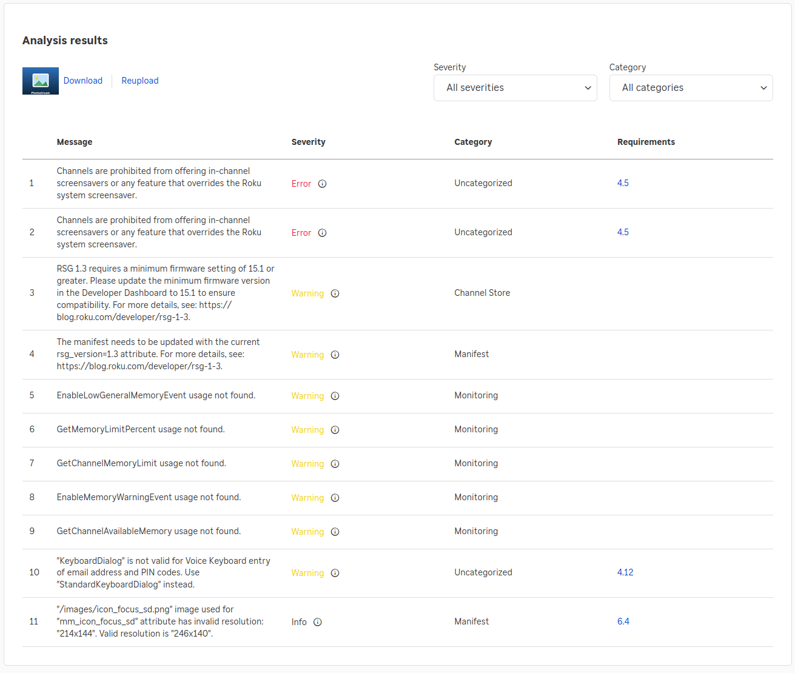

# Roku Photo Screensaver

[](https://github.com/1800alex/rokuscreensaver/actions/workflows/release.yml)
[](LICENSE)

A family-photo screensaver for your Roku. A small backend (run with Docker)
cycles through your photos — from a local folder or an [Immich](https://immich.app)
album — and periodically slips in a weekly **calendar** with the **weather**. The
Roku channel is a dead-simple screensaver that just shows whatever the backend is
serving, refreshing every few seconds.

> ⚠️ **This channel must be sideloaded — it is not in the Roku Channel Store and
> never can be.** Roku certification **prohibits channels from providing their
> own screensaver** ("Channels are prohibited from offering in-channel
> screensavers or any feature that overrides the Roku system screensaver"), so it
> fails analysis and cannot be listed. The supported way to install it is to put
> your Roku in developer mode and sideload the prebuilt
> [`screensaver.zip`](https://github.com/1800alex/rokuscreensaver/releases) — see
> [Install the Roku channel](#install-the-roku-channel) below. There is no public
> channel to add.
>
> 

## Quick start

You need a machine that runs **Docker** (a NAS, a Raspberry Pi, a home server)
and a Roku on the same network.

### Start the backend

Everything ships prebuilt — you don't compile anything. Grab the bundled
[docker-compose.yml](docker-compose.yml), which already points at the published
images (multi-arch, so it runs on a Raspberry Pi too):

```sh
# in a folder next to your photos:
curl -O https://raw.githubusercontent.com/1800alex/rokuscreensaver/master/docker-compose.yml
mkdir photos        # drop some photos in here
docker compose up -d
```

That starts two containers — the photo **backend** (port `9543`) and the
**calrender** calendar/weather renderer (port `9544`). Confirm it's serving:

```sh
curl -o frame.jpg http://localhost:9543/feed.jpg   # the current frame
```

Then open [docker-compose.yml](docker-compose.yml) and edit the `environment:`
values for your setup — photo source, calendar feed, weather location, screen
resolution. See [Configuration](#configuration) below. Re-run
`docker compose up -d` to apply changes.

### Install the Roku channel

1. **Download** the latest [`screensaver.zip`](https://github.com/1800alex/rokuscreensaver/releases)
   from the Releases page.
2. **Enable developer mode** on the Roku: press **Home ×3, Up ×2, Right, Left,
   Right, Left, Right**. Accept the agreement, set a password, and note the **IP
   address** it shows.
3. **Upload the zip:** in a browser on the same network, go to `http://<roku-ip>`,
   log in (user `rokudev` + the password you set), choose `screensaver.zip`, and
   click **Install**. You should see *Install Success*.

### Switch it on

1. On the Roku, open the **Photostream** channel tile once. It shows a live
   preview with a *"Press \* for Settings"* hint — press the remote's **`*`**
   button and set the **Address** (and Port, if you changed it) to your backend
   machine's IP, then **Save**.
2. Go to **Settings → Theme → Screen saver**, pick **Photostream**, and set
   **Wait time** (e.g. 5 minutes). After that idle delay your photos take over,
   with the calendar sliding in every so often.

## Configuration

All configuration is **environment variables**, set under each service's
`environment:` block in [docker-compose.yml](docker-compose.yml) (the file is
heavily commented). Change a value, then `docker compose up -d` to apply it.
Anything secret — like an Immich API key — should go in a `.env` file next to the
compose file instead of being written inline (see below).

### Photo source

Pick **one** of two sources for the `backend` service:

- **A folder (default).** Put images in the `./photos` directory that the compose
  file mounts at `/photos`. New photos are picked up automatically.
- **An Immich album.** Set these three and the folder is ignored — the screensaver
  cycles the album, picking up anything you add to it:

  ```yaml
  IMMICH_HOST: "http://your-immich-host:2283"
  IMMICH_API_KEY: ${IMMICH_API_KEY}    # put the real key in a .env file
  IMMICH_ALBUM_ID: "your-album-uuid"
  ```

  Create the API key in Immich under *Account Settings → API Keys*, and grab the
  album ID from the album's URL (`/albums/<id>`). To keep the key out of version
  control, put `IMMICH_API_KEY=...` in a `.env` file beside the compose file and
  reference it as `${IMMICH_API_KEY}` like above.

How often a photo changes is `IMAGE_DURATION_SECONDS`. Portrait photos on a
landscape TV are filled with a blurred copy of the image rather than black bars
(`BLUR_FILL`); set the output resolution with `WIDTH`/`HEIGHT` (use `3840`/`2160`
for 4K).

### Calendar

The `calrender` service fetches an **iCalendar (`.ics`)** feed for the upcoming
week and renders it into a TV-friendly schedule that the screensaver shows after
every `CALENDAR_INTERVAL` photos. Point it at your own feed with
`CAL_URL_TEMPLATE` — the `{{.Start}}` / `{{.End}}` / `{{.TZEnc}}` tokens are
filled in with the current week each render:

```yaml
CAL_URL_TEMPLATE: "https://your-calendar-host/export?start={{.Start}}&end={{.End}}&tz={{.TZEnc}}"
TZ: America/New_York     # the week is computed in this timezone
DAYS: "7"                # how many days to show
```

Most calendar apps (Google Calendar, a self-hosted CalDAV server, etc.) can give
you an `.ics` export URL. To turn the calendar off entirely, leave
`CALENDAR_PHOTO` unset or set `CALENDAR_INTERVAL: "0"`. (The full list of template
tokens is in [DEVELOPMENT.md](DEVELOPMENT.md#feed-url-template-tokens).)

### Weather

Turn on a current-conditions block in the calendar header — no API key needed, it
uses [wttr.in](https://wttr.in):

```yaml
WEATHER: "on"
WEATHER_LOCATION: "New York"   # your city
WEATHER_UNITS: F               # F or C
```

### Environment variable reference

**Backend** (`backend` service):

| Variable                 | Default                    | Meaning                                          |
| ------------------------ | -------------------------- | ------------------------------------------------ |
| `PHOTO_DIR`              | `/photos`                  | Directory of source photos (folder mode)         |
| `CALENDAR_PHOTO`         | `/calendar/calendar.jpg`   | Calendar image (leave unset to disable)          |
| `CALENDAR_INTERVAL`      | `10`                       | Show the calendar after this many photos (0=off) |
| `IMAGE_DURATION_SECONDS` | `10`                       | How long each image is the current frame         |
| `WIDTH` / `HEIGHT`       | `1920` / `1080`            | Output resolution in px (use `3840`/`2160` for 4K) |
| `BLUR_FILL`              | `1`                        | Fill letterbox bars with a zoomed, blurred copy of the image; `0`=plain black |
| `BLUR_SIGMA`             | `25`                       | Blur strength (px) for the fill background       |
| `BG_BRIGHTNESS`          | `70`                       | Fill background brightness % (`100`=no dimming)  |
| `PORT`                   | `9543`                     | Listen port                                      |
| `IMMICH_ALBUM_ID`        | (unset)                    | Immich album UUID — **set this to use Immich mode** |
| `IMMICH_URL`             | (unset)                    | Immich base URL, e.g. `http://host:2283` (alias: `IMMICH_HOST`) |
| `IMMICH_API_KEY`         | (unset)                    | Immich API key (`x-api-key`)                     |
| `IMMICH_IMAGE_SIZE`      | `original`                 | `original`, `preview`, or `thumbnail`            |
| `IMMICH_REFRESH_MINUTES` | `1440`                     | How often to re-fetch the album's asset IDs      |
| `PREFETCH`               | `1`                        | Converted frames to keep ready in memory (≥1)    |
| `BATCH`                  | `0`                        | `1`/`on` to pre-render the whole source to `CACHE_DIR` ([details](DEVELOPMENT.md#lazy-conversion-vs-batch-pre-render)) |
| `CACHE_DIR`              | `/cache`                   | Where batch-rendered frames live — **must differ from `PHOTO_DIR`** |

**Calendar renderer** (`calrender` service):

| Variable           | Default                  | Meaning                                            |
| ------------------ | ------------------------ | -------------------------------------------------- |
| `CAL_URL_TEMPLATE` | (example feed)           | Go template for your `.ics` URL                    |
| `TZ`               | `America/New_York`       | Timezone the "this week" window is computed in     |
| `WIDTH` / `HEIGHT` | `1920` / `1080`          | Output resolution in px (match your screen)        |
| `DAYS`             | `7`                      | Days in the window, starting today (1–14)          |
| `TITLE`            | `This Week`              | Heading shown top-left                             |
| `REFRESH_MINUTES`  | `60`                     | Re-fetch + re-render cadence                       |
| `WEATHER`          | `0`                      | `1`/`on` to show weather in the header             |
| `WEATHER_LOCATION` | `New York`               | wttr.in location                                   |
| `WEATHER_UNITS`    | `F`                      | `F` or `C`                                         |

## Building from source & how it works

Building the images and the Roku zip yourself, plus the internals of the backend,
the calendar renderer, and the Roku channel, are documented in
**[DEVELOPMENT.md](DEVELOPMENT.md)**.
